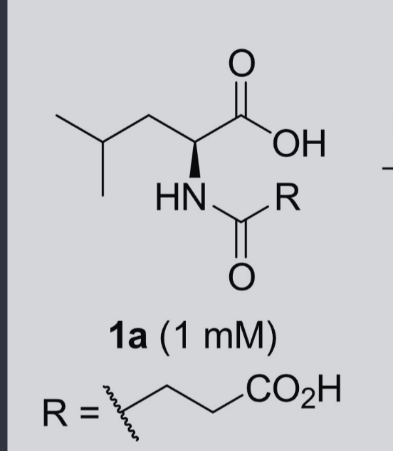

# SMILES String Extraction from PDB Structures

Workflow for extracting SMILES strings from ligands in the SadA Rosetta model using PyMOL and Open Babel.

---

## Overview

Two ligands were extracted from `SadA_rosetta_2024_3_6_p.pdb`:

| Ligand | Name | SMILES |
|--------|------|--------|
| **NEU** | N-Succinyl-L-leucine | `C([C@H](NC(=O)CCC(=O)O)C(=O)O)C(C)C` |
| **AKG** | α-Ketoglutarate | `C(=O)(C(=O)CCC(=O)O)O` |

---

## Step 1 — Extract Ligands from PyMOL

Load the structure and save each ligand selection as a separate PDB file:

```
PyMOL> load SadA_rosetta_2024_3_6_p.pdb
PyMOL> save NEU.pdb, sele
PyMOL> save AKG.pdb, sele
```

## Step 2 — Convert to SMILES with Open Babel

Install Open Babel (if needed) and convert:

```bash
brew install open-babel

obabel NEU.pdb -osmi
# C([C@H](NC(=O)CCC(=O)O)C(=O)O)C(C)C   NEU.pdb
# 1 molecule converted

obabel AKG.pdb -osmi
# C(=O)(C(=O)CCC(=O)O)O   AKG.pdb
# 1 molecule converted
```

## Verification

The NEU SMILES corresponds to the open-chain form of N-Succinyl-L-leucine, confirmed against the published structure (compound **1a**):



> **Note:** Some online databases list a cyclic succinimide form (`CC(C)C[C@@H](C(=O)O)N1C(=O)CCC1=O`) for this compound. The PDB coordinates and the published diagram both confirm the **open-chain** form shown above.


